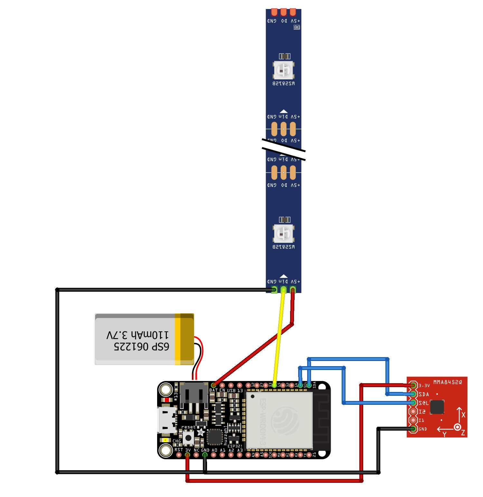

### This project contains two parts:
### 1- Arduino Code for The Esp32 controller (esp32_control):
 - Make esp32 run as a Bluetooth server 
 - Recieve the readings from the connected accelerometer and classify them based on certian thresholds 
 - The classifed events could be one of the following: shaking (to finish a task), flip horizentally (swtich to  task view when pomodoro mode is on), flip 180 degrees (toggle pomodoro)
 - Based on the classifed event, change the LED output and send short messages to the connected Bluetooth device.

### 2- Andoid app (rainmaker_app):
 - Connect to the rainmaker using Bluetooth
 - Add, edit, remove tasks in a tasks list, while simultaneously send the updates to the rainmaker device over Bluetooth
 - Recieve messages from the rainmaker that contains infromation about the tasks progess

### Preparing the hardware:
The following components have been used:  
Battery : https://www.adafruit.com/product/2750  
Microcontroller : https://www.adafruit.com/product/2821  
Orientation Sensor : https://learn.adafruit.com/adafruit-bno055-absolute-orientation-sensor  
LED strip : https://www.adafruit.com/product/1138?length=1  

Then they are connected as per the following (click on image to show in full size):

### Required libraries 
The following libraries need to be installed before uploading the arduino code to esp32:  
FastLED.h: https://github.com/FastLED/FastLED  
Adafruit_Sensor.h:  https://github.com/adafruit/Adafruit_Sensor  
Adafruit_BNO055: https://github.com/adafruit/Adafruit_BNO055
